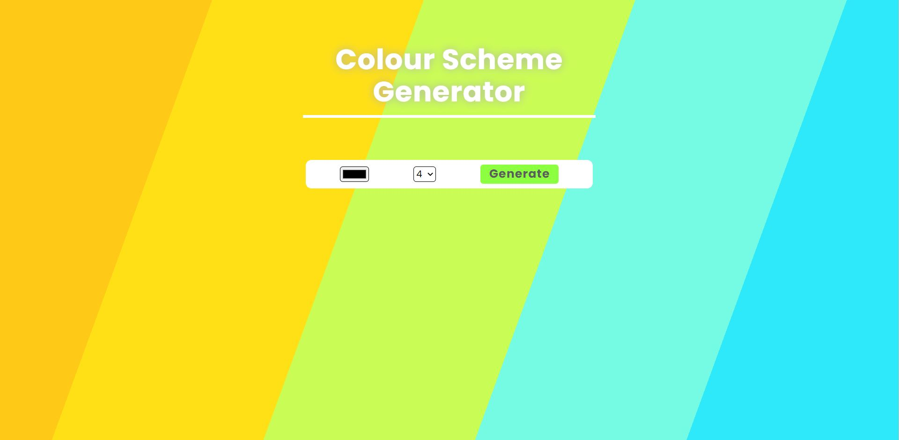
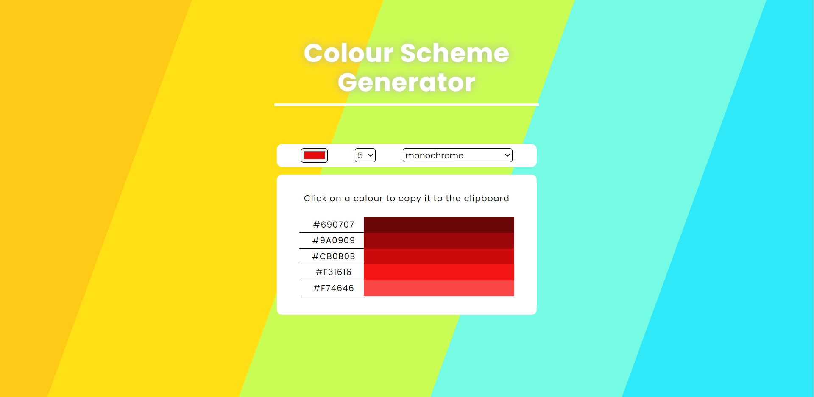
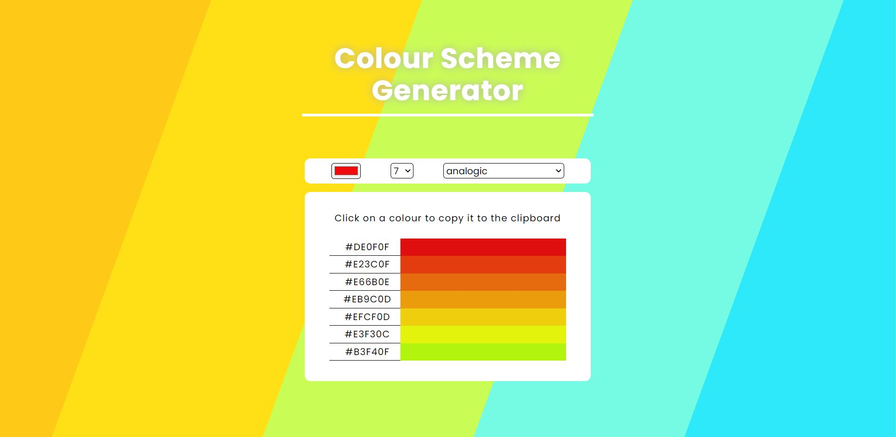

# colour-scheme-generator
Generates colour schemes based on a colour

the app lets the user pick a colour then it uses an api to retrieve the colour schemes

the user can change the colour, the number of colours displayed and the scheme type

img1 shows the default parameters on the homepage when the site first loads

img2 and img3 show the generated colour schemes and a few colour variations

